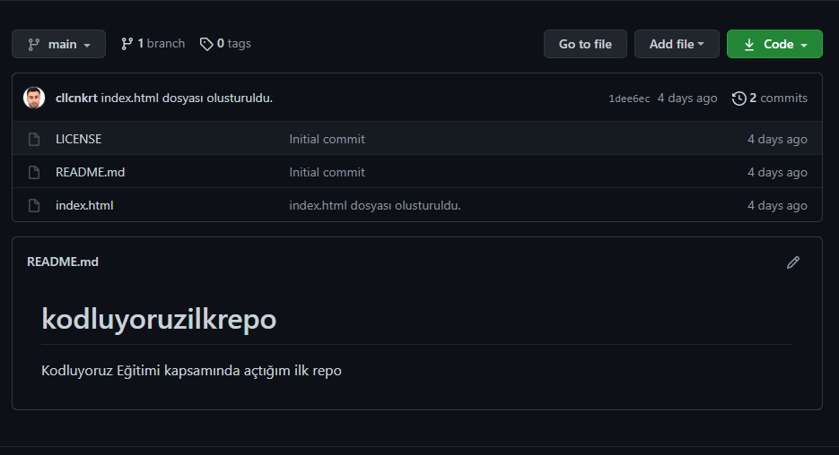

# Kodluyoruz İlk Repo

Bu repo Kodluyoruz Front-End Eğitiminde oluşturduğum ilk repo. İçerisinde bir adet README dosyası, bir adet de index.html ve bir adet img klasörü barındırıyor.



## Installation

---

Öncelikle projeyi clonelayın.

```
git clone https://github.com/cllcnkrt/kodluyoruzilkrepo.git
```

## Usage

---

Projeyi cloneladıktan sonra Visual Studio Code programında açınız.

Microsoft için:

```
cd kodluyoruzilkrepo
code .
```

## Contributing

---

Pull requestler kabul edilir. Büyük değişiklikler için, lütfen önce neyi değiştirmek istediğinizi tartışmak için bir konu açınız.

## License

---

[MIT](https://choosealicense.com/licenses/mit/)
